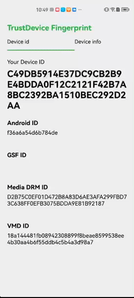

<p align="center">
    <picture>
      <source media="(prefers-color-scheme: dark)" srcset="resources/logo_light.png" />
      <source media="(prefers-color-scheme: light)" srcset="resources/logo_dark.png" />
      
    </picture>
</p>
<p align="center">
  <a href="https://jitpack.io/#trustdecision/trustdevice-android">
    
  </a>
  <a href="https://github.com/trustdecision/trustdevice-android/actions?workflow=android">
    
  </a>
  <a href="https://android-arsenal.com/api?level=21">
    
  </a>
</p>
<p align="center">
	<a href='https://play.google.com/store/apps/details?id=com.trustdevice.android&pcampaignid=pcampaignidMKT-Other-global-all-co-prtnr-py-PartBadge-Mar2515-1'>
		
	</a>
</p>
<p align="center">
  
</p>


# TrustDevice-Android
A lightweight library for determining device uniqueness and risk identification.

Create a device identifier based on basic device information.

Will remain the same after uninstalling and reinstalling or clearing app data.

🪧Attention🪧：The functions of the basic version of github are relatively limited. 

You can visit [AWS Marketplace](https://aws.amazon.com/marketplace/pp/prodview-5fkjqqnkoajcs?sr=0-1&ref_=beagle&applicationId=AWSMPContessa) or [TrustDecision](https://trustdecision.com/solutions/device-fingerprint)  to learn about our professional version.

## Quick start

### 1. Add repository

Add these lines to your `build.gradle`.
```groovy
allprojects {
    repositories {
        mavenCentral()
    }
}
```

If your version of Gradle is 7 or newer, add these lines to your `settings.gradle`:
```groovy
repositories {
        ...
        mavenCentral()
    }
```

### 2. Add dependency

Add these lines to `build.gradle` of a module.
```groovy
dependencies {
    ...
    implementation 'com.trustdecision.android:mobrisk:1.1.0'
}
```

### 3. Get deviceInfo

DeviceInfo contains device id, risk information and device details.

#### 3.1. Option 1

```java
// initialization
TDRisk.init(context);

// usage
JSONObject deviceInfo = TDRisk.getBlackbox();
// Obtain deviceid and risk information through deviceInfo
String deviceID = deviceInfo.optString("device_id");
JSONObject deviceRisk = deviceInfo.optJSONObject("device_risk_label");
JSONObject deviceDetail = deviceInfo.optJSONObject("device_detail");
```

`getBlackbox` method executes in the calling thread and takes time to execute.

#### 3.1.2. Option 2

```java
TDRisk.Builder builder = new TDRisk.Builder();
builder.callback(new TDRiskCallback() {
    @Override
    public void onEvent(JSONObject deviceInfo) {
      	// Obtain deviceid and risk information through deviceInfo
        String deviceID = deviceInfo.optString("device_id");
        JSONObject deviceRisk = deviceInfo.optJSONObject("device_risk_label");
        JSONObject deviceDetail = deviceInfo.optJSONObject("device_detail");
    }
});
TDRisk.initWithOptions(context, builder);
```

`callback` is in a sub-thread, please do not perform UI operations.

## Data Sample

```json
{
  "device_id": "55161BB8343D62230217F2D8206B67D428AE288F788C379341A0A95D4300B3A3",
  "device_risk_label": {
    "root": "true",
    "debug": "true",
    "multiple": "false",
    "xposed": "false",
    "magisk": "true",
    "hook": "false",
    "emulator": "false",
    "vpn": "false",
    "device_info_tampered": "false"
  },
  "device_detail": {
    "abiType": "arm64-v8a,armeabi-v7a,armeabi",
    "accessibilityEnabled": "0",
    "adbEnabled": "1",
    "allowMockLocation": "0",
    "androidId": "4d52a39e07b9e464",
    "androidVersion": "13",
    "appList": "...",
    "availableMemory": "3012796416",
    "availableStorage": "44510015488",
    "batteryHealthStatus": "good",
    "batteryLevel": "100",
    "batteryStatus": "full",
    "batteryTemp": "294",
    "batteryTotalCapacity": "2800.0",
    "brand": "google",
    "coresCount": "8",
    "country": "CN",
    "cpuHardware": "Qualcomm Technologies, Inc SM8150",
    "cpuProcessor": "AArch64 Processor rev 14 (aarch64)",
    "dataRoaming": "0",
    "debug": "7",
    "defaultInputMethod": "com.google.android.inputmethod.latin/com.android.inputmethod.latin.LatinIME",
    "developmentSettingEnabled": "1",
    "display": "TP1A.221005.002",
    "emulator": "false",
    "filesAbsolutePath": "/data/user/0/com.trustdevice.android/files",
    "fingerprint": "google/flame/flame:13/TP1A.221005.002/9012097:user/release-keys",
    "gsfId": "3750143927290222004",
    "hardware": "flame",
    "harmonyOS": "false",
    "hook": "",
    "host": "abfarm-release-rbe-64-00071",
    "httpProxy": "",
    "kernelVersion": "4.14.276-gecab2e0c9918-ab8931408",
    "language": "zh",
    "magisk": "true",
    "manufacturer": "Google",
    "mediaDrmId": "A069CC34B11C17F1C390575C794166F83CDE53B0887D2F718EDC901ED337FDF4",
    "model": "Pixel 4",
    "packageName": "com.trustdevice.android",
    "product": "flame",
    "root": "true",
    "screenBrightness": "57",
    "screenInches": "5.67",
    "screenOffTimeout": "600000",
    "screenResolution": "1080x2280",
    "sdkVersion": "33",
    "sensorsInfo": "...",
    "systemAppList": "...",
    "timezone": "中国标准时间",
    "totalMemory": "5730922496",
    "totalStorage": "53684973568",
    "touchExplorationEnabled": "0",
    "vbMetaDigest": "7258013a5672eb08b29be5b233b1b49c36b0eb1cd58a896b7575b2be3fc6dc99",
    "xposed": "false"
  }
}
```

## Open Source Features

- Basic device ID, This identifier is stable, it will remain the same even after uninstalling and reinstalling your app. But it will be different after factory reset of the device.
- Basic equipment information, which can be used for simple data analysis
- Basic risk identification ability

| RiskLabel | Risk Description                                             |
| --------- | ------------------------------------------------------------ |
| root      | Attackers will have higher privileges and can install many cheating software to affect the normal development of application business. |
| debug     | Applications can be modified by attackers at will, and the program will return unexpected values. |
| multiple  | Attackers can clone multiple app.                            |

## Open Source VS Pro

|                               | Open Source |       Pro        |
| ----------------------------- |:-----------:|:----------------:|
| 100% open source              |     Yes     |        No        |
| Device ID                     |    Basic    | Extremely stable |
| Device Risk Label             |    Basic    |  Extremely rich  |
| Device Details                |    Basic    |  Extremely rich  |
| IP Location                   |      -      |        ✓         |
| Device Risk Score             |      -      |        ✓         |
| Environment Risk Evaluation   |      -      |        ✓         |
| Fraud Tools Detection         |      -      |        ✓         |
| Behavioral Activity Capturing |      -      |        ✓         |

## Pro Introduction

TrustDecision TrustDevice has the leading device fingerprint technology, which has been integrated by more than 10000 global leading brands, protecting the entire customer journey.

**There are 6 leading core features about TrustDevice Pro:**

### 1. Wide Coverage

Comprehensive coverage of Android, iOS, Web, H5, applets and other device types.

### 2. Stable and Reliable

TrustDevice served more than 10,000 clients, 200 million+ daily active users , and 6 billion+ devices , with excellent product functions and stability.
The fingerprint accuracy of different terminal devices exceeded 99.9%, and the output of risk labels exceeded 70 items.

### 3. Unparalleled Safety

TrustDevice's code virtualization & obfuscation technology make the malware fraudsters suffer from painful cost and imprecision when performing reverse-engineering.

### 4. Core Intellectual Property

Fully independent intellectual property rights, with a number of patented technology.

### 5. Security Compliance

TrustDevice is committed to the highest standards in security and compliance to keep your data safe.
GDPR/CCA/PCI DSS/ISO 27701/ISO 9001 Compliant.

### 6. Easy to Deploy

SaaS(Software as a Service)deployment supported, reducing massively your integration cost and enabling rapid access to device fingerprint service.

## Where to get support

We are happy to provide technical support for our open-source trustdevice-android library. We recommend using GitHub Issues to submit bugs or Discussions to ask questions. Using [Issues](https://github.com/trustdecision/trustdevice-android/issues) and [Discussions](https://github.com/trustdecision/trustdevice-android/discussions) publicly will help the open-source community and other users with similar issues.

In addition, any idea or interest in using TrustDevice Pro can be found on the [www.trustdecision.com](https://www.trustdecision.com/trustDevice),  registered account for a free trial; or via email trustdevice@trustdecision.com contact us directly and quickly open the service.

## TrustDevice Android Demo App

Try the library features in the [TrustDevice Android Demo App](https://github.com/trustdecision/trustdevice-android/releases/download/1.0.3/TrustDevice-release-1.0.3.apk).

## Compatibility

| Items                     | Description             |
| :-----------------------: |:-----------------------:|
| Supported System Versions | Android5.0+ ( API 21+ ) |
| Supported Architecture    | armeabi-v7a, arm64-v8a, x86,x86_64 |

## TrustDevice Pro VS Others
<table>
    <tr align="center">
        <th>Type</th><th>Scene</th><th>Result</th><th>TrusDevice Pro</th><th>Fingerprint</th><th>Seon</th><th>Sift</th>
    </tr>
    <tr align="center">
        <td rowspan="2">Device Fingerprint Compatibility</td><td>Support Hongmeng system, including HarmonyOS 3.0, etc.</td><td>Able to collect device info and generate device ID</td><td>✅</td><td>✅</td><td>✅</td><td>✅</td>
    </tr>
    <tr align="center">
        <td>Android 5.0 and above, including Android 14, etc.</td><td>Able to collect device info and generate device ID</td><td>✅</td><td>✅</td><td>✅</td><td>✅</td>
    </tr>
    <tr align="center">
        <td rowspan="2">Device fingerprint uniqueness</td><td>Different Apps (with different package names) on the same device</td><td>Device fingerprint/ID matches</td><td>✅</td><td>✅</td><td>✅</td><td>✅</td>
    </tr>
    <tr align="center">
        <td>The same app on two unique devices (including the case of the same device model and the same system version)</td><td>Device fingerprint/ID should not match. Each device to have its own unique device fingeprint/ID</td><td>✅</td><td>✅</td><td>✅</td><td>✅</td>
    </tr>
    <tr align="center">
        <td rowspan="7">Device Fingerprint Stability</td><td>Uninstall and reinstall of app</td><td>Device fingerprints/ID are consistent before and after reinstallation</td><td>✅</td><td>✅</td><td>✅</td><td>✅</td>
    </tr>
    <tr align="center">
        <td>Clear all app data</td><td>Device fingerprints/ID are consistent before and after clearing all app data</td><td>✅</td><td>✅</td><td>✅</td><td>✅</td>
    <tr align="center">
        <td>Disable all app permissions except network permissions and clear app data</td><td>Device fingerprints/ID are consistent before and after disabling all permissions</td><td>✅</td><td>✅</td><td>✅</td><td>✅</td>
    </tr>
    <tr align="center">
        <td>Modify the common information of the device system (brand, model, IMEI number, MAC address, etc.) through the device modification tool</td><td>Device fingerprint/ID still matches with before modification</td><td>✅</td><td>✅</td><td>✅</td><td>❌</td>
    </tr>
    <tr align="center">
        <td>Running same app in two instances using virtualization on the same device (i.e. using parallel space or dual space tools)</td><td>Device fingerprint/ID still matches between both app instances</td><td>✅</td><td>✅</td><td>✅</td><td>✅</td>
    </tr>
    <tr align="center">
        <td>Android system upgrade</td><td>Device fingerprint/ID are consistent before and after system upgrade</td><td>✅</td><td>✅</td><td>✅</td><td>✅</td>
    </tr>
    <tr align="center">
        <td>Factory reset (including Android 10 and above, etc.)</td><td>The device fingerprints are the same before and after the device is restored to factory settings</td><td>✅</td><td>❌</td><td>❌</td><td>❌</td>
    </tr>
    <tr align="center">
        <td rowspan="18">Device Fingerprint Risk Identification</td><td>Secondary packaging</td><td>Ability to identify secondary packaged unofficial apps</td><td>✅</td><td>❌</td><td>❌</td><td>❌</td>
    </tr>
    <tr align="center">
        <td>Replay attack</td><td>Ability to identify replay attacks</td><td>✅</td><td>❌</td><td>❌</td><td>❌</td>
    </tr>
    <tr align="center">
        <td>Suspected risky ROM</td><td>Ability to identify suspected risky ROMs</td><td>✅</td><td>❌</td><td>❌</td><td>❌</td>
    </tr>
    <tr align="center">
        <td>Device location information has been tampered with</td><td>Ability to identify tampering of location information</td><td>✅</td><td>❌</td><td>❌</td><td>❌</td>
    </tr>
    <tr align="center">
        <td>The device does not have a SIM card inserted</td><td>Can identify whether the device is inserted with a SIM card</td><td>✅</td><td>❌</td><td>❌</td><td>❌</td>
    </tr>
    <tr align="center">
        <td>The device uses an HTTP proxy</td><td>Can identify HTTP proxy risks</td><td>✅</td><td>❌</td><td>❌</td><td>❌</td>
    </tr>
    <tr align="center">
        <td>The device uses a VPN proxy</td><td>Can identify VPN proxy risks</td><td>✅</td><td>❌</td><td>❌</td><td>❌</td>
    </tr>
    <tr align="center">
        <td>The device is Rooted</td><td>Ability to identify root risks</td><td>✅</td><td>❌</td><td>✅</td><td>✅</td>
    </tr>
    <tr align="center">
        <td>The device is an Android emulator</td><td>Can recognize emulator/simulator</td><td>✅</td><td>❌</td><td>✅</td><td>❌</td>
    </tr>
    <tr align="center">
        <td>The device is an Android cloud emulator</td><td>Ability to recognize cloud emulators</td><td>✅</td><td>❌</td><td>✅</td><td>❌</td>
    </tr>
    <tr align="center">
        <td>The device is an Android cloud real device</td><td>Can identify cloud real device</td><td>✅</td><td>❌</td><td>❌</td><td>❌</td>
    </tr>
    <tr align="center">
        <td>Devices use system virtualization tools (i.e. parallel space, dual space, etc)</td><td>Able to identify system virtualization tools</td><td>✅</td><td>❌</td><td>❌</td><td>❌</td>
    </tr>
    <tr align="center">
        <td>The device uses the virtualization tool to launch multiple instances of same application</td><td>Recognize multiple instances of same applications on same device opened via virtualization tool</td><td>✅</td><td>❌</td><td>❌</td><td>❌</td>
    </tr>
    <tr align="center">
        <td>The device uses the device modification tool to modify the device parameter information</td><td>Ability to identify mainstream modification tools</td><td>✅</td><td>❌</td><td>❌</td><td>❌</td>
    </tr>
    <tr align="center">
        <td>The device uses scripting tools</td><td>Can identify mainstream scripting tools</td><td>✅</td><td>❌</td><td>❌</td><td>❌</td>
    </tr>
    <tr align="center">
        <td>The device uses the group control tool (tools to control multiple devices via a single terminal - device farm/device group)</td><td>Can identify mainstream group control tools</td><td>✅</td><td>❌</td><td>❌</td><td>❌</td>
    </tr>
    <tr align="center">
        <td>The device is in Android ADB debugging state</td><td>Able to recognize Android ADB debugging</td><td>✅</td><td>❌</td><td>❌</td><td>✅</td>
    </tr>
    <tr align="center">
        <td>The device uses offerwall software (ad scamming software)</td><td>Ability to identify devices using offerwall software</td><td>✅</td><td>❌</td><td>❌</td><td>❌</td>
    </tr>
    <tr align="center">
        <td rowspan="3">Security and Stability</td><td>Code Protection</td><td>The device fingerprint SDK and JS have code protection mechanisms (such as VMP), which effectively resist black hat cracking attempts to manipulate code logic and falsify data</td><td>✅ (OLLVM, VMP)</td><td>❌</td><td>❌</td><td>❌</td>
    </tr>
    <tr align="center">
        <td>Downgrade</td><td>Intercepting and sending collection requests in the Android environment can still generate device fingerprints normally</td><td>✅</td><td>❌</td><td>✅</td><td>❌</td>
    </tr>
    <tr align="center">
        <td>Anti packet capture</td><td>Android has the ability to prevent packet capture</td><td>✅</td><td>❌</td><td>❌</td><td>❌</td>
    </tr>
</table>

## License

This library is MIT licensed. Copyright trustdecision, Inc. 2022.
